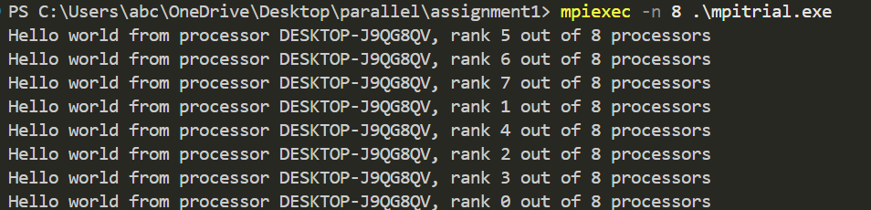
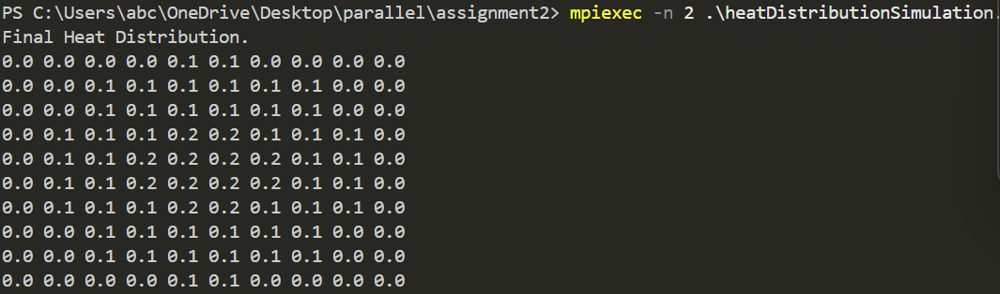
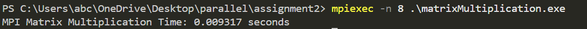
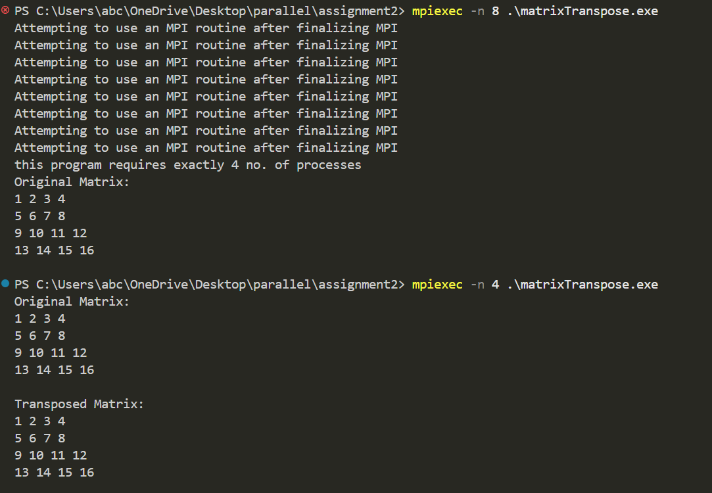
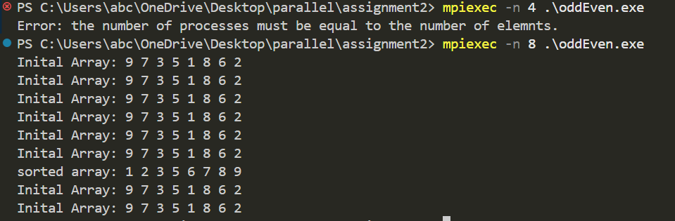
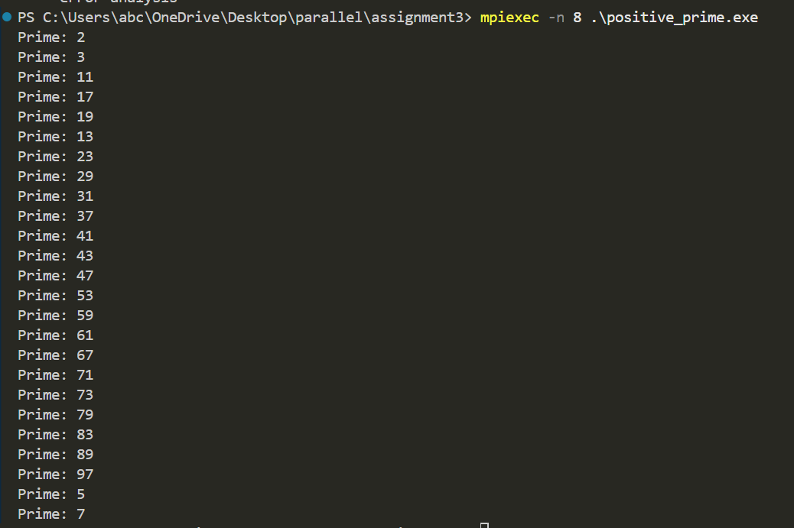
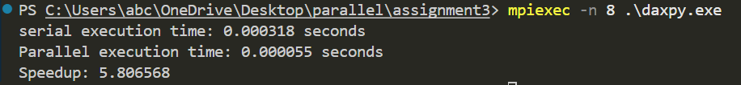

# Parallel Computing with MPI

## Introduction
Message Passing Interface (MPI) is a powerful tool for parallel computing, enabling efficient communication between processes in a distributed system. It helps in handling large-scale computations by breaking tasks into smaller parallel operations.

## Assignments Overview
This repository contains three assignments showcasing MPI concepts:

### **Assignment 1: MPI Basics**
- **MPI_Init & MPI_Finalize**: Initializes and closes MPI execution.
- **MPI_Comm_size & MPI_Comm_rank**: Identifies the number of processes and their ranks.
- **Point-to-Point Communication**: Sending & receiving messages between processes.

Example Files: `MainSample.c`, `SendRecv.c`

#### **Sample Output**



---

### **Assignment 2: Parallel Computation**
- **Matrix Operations**: Distributed multiplication and transposition.
- **Parallel Reduction**: Summation & aggregation across processes.
- **Pi Approximation**: Monte Carlo & numerical integration methods.

Example Files: `matrixMultiplication.c`, `parallelReduction.c`, `pi.c`







### **Assignment 3: Advanced MPI Concepts**
- **Scatter & Gather**: Distributing & collecting data efficiently.
- **MPI_Broadcast & Reduce**: Spreading and aggregating values across nodes.

Example Files: `daxpy.c`, `Pi_MPI.c`, `positive_prime.c`





## Compilation & Execution
Compile using:
```sh
mpicc -o output source.c
```
Run with `N` processes:
```sh
mpirun -np N ./output
```

## Conclusion
This project demonstrates the practical use of MPI in parallel computing, helping in optimizing large-scale computations.

---
**Made with ❤️ by Shaurya Bhatia**
